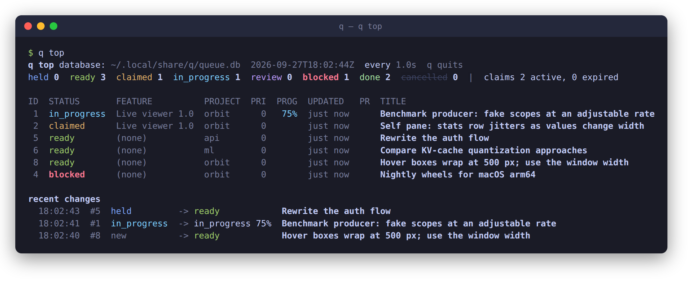
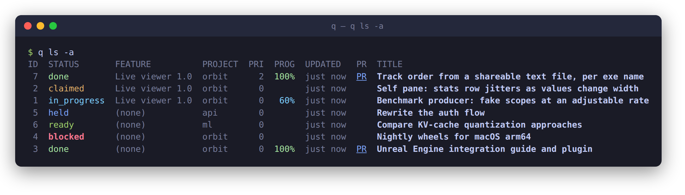
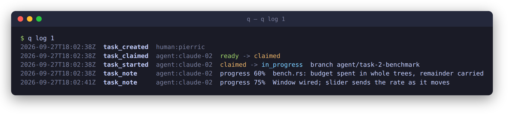
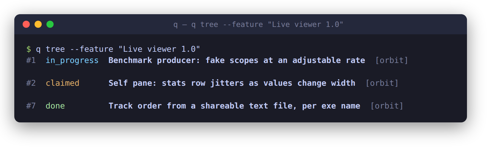

# q

The explicit work queue for your coding agents. Capture tasks and say which
are ready; idle Claude Code, Codex or Cursor sessions claim them, one at a
time, atomically, over the CLI or MCP; you watch the queue move.



`q` is one binary and one SQLite file. The CLI, the MCP server (`q mcp`) and
the shared server (`q serve`) all call the same service, so a queue on your
laptop and a queue shared by a fleet behave the same way.

## Install

```bash
cargo install --path crates/q-cli --locked     # needs stable Rust 1.88+
q skill install                                # teaches Claude, Codex and Cursor how to use it
```

## Sixty seconds

You capture. A bare title is a task; it is `ready` at once. `--hold` keeps it
for a human look first.

```bash
q "Benchmark producer: fake scopes at an adjustable rate"
q --hold "Rewrite the auth flow"
q ready 5                    # the human gate: only a person can do this
```

An agent claims. One transaction picks one eligible task, leases it, and hands
back a token. No work is not an error. `q claim 2 --agent claude-01` claims
that task in particular, under the same rules.

```bash
q claim --agent claude-01 --json
q start 2 --claim-token TOKEN --branch agent/task-2-benchmark
q log 2 "bench.rs: budget spent in whole trees" --progress 60 --claim-token TOKEN
q complete 2 --claim-token TOKEN --summary "Producer and window" --artifact pr=https://github.com/acme/x/pull/86
```

You watch.

```bash
q ls -a
```



`q top` is the same table, redrawn every second with ages to the second, with the last changes
underneath. Press `q` to leave it.

## The log

Every task carries an append-only log: who claimed it, when it started, on
which branch, what the agent noted and how far along it said it was, what it
attached, and how it ended. State changes are logged by the queue itself;
agents add notes and progress as they go.



`--attach report=PATH` stores a report's text in the database, so it outlives
the file. `--artifact pr=URL` links the pull request; `q ls` and `q top` show
it as a clickable `PR`.

## Features and dependencies

A feature groups tasks, even across repos. `q tree` prints what must be done
first.

```bash
q feature create "Live viewer 1.0"
q add --feature "Live viewer 1.0" "Self pane: stats row jitters as values change width"
q tree --feature "Live viewer 1.0"
```



## What keeps it safe

- Only a human runs `q ready`, `q hold`, and `q reopen`, and only a human
  accepts a task in `review` (`q complete` with no claim token). On `q serve`
  an agent token is refused for those. `queue_ready`, `queue_hold`, and
  `queue_reopen` are MCP tools for a human session on `q serve` only; local
  stdio does not offer them.
- A claim is one `BEGIN IMMEDIATE` transaction with a lease. Two agents cannot
  take the same task; an agent that goes quiet loses it when the lease ends.
- `high` and `external_action` risk stay out of default claims, and a project
  with `require_pr` sends finished implementation work to `review` for a
  person to accept.
- The queue never launches agents, opens pull requests, merges or deploys.

## Agents

`q skill install` writes the agent skill into `~/.claude`, `~/.codex`,
`~/.cursor` and `~/.agents`. After it is loaded, say **start the q worker**.
The agent claims one ready task, heartbeats about every minute, notes
meaningful steps, then marks the task done or failed and looks again. An
empty queue waits about 30 seconds. There is no `q work` command: the agent
does the work, and `q` only tracks it. A failed task goes back to ready so
another agent can take it. A task that is too big, or that the worker cannot
do, is escalated instead and waits for a human.

For MCP clients, point them at the binary:

```json
{ "mcpServers": { "q": { "command": "/absolute/path/to/q", "args": ["mcp"] } } }
```

## One queue for many machines

```bash
q serve --bind 0.0.0.0:7777 --db /var/lib/q/queue.db --auth /etc/q/tokens.toml   # where the database lives
export Q_SERVER_URL=https://q.example.com Q_SERVER_TOKEN=...                       # everywhere else
```

Every `q` command and `q mcp` then talk to that server. Claims stay serialized
by the same transaction they use locally, because there is only one place to
take a task from.

## More

The [reference](docs/reference.md) covers every command, flag, status, the
JSON output, the MCP tools, the server's wire format, and the crate layout.
The pictures above are rendered from real output by
[`docs/images/render.py`](docs/images/render.py).
